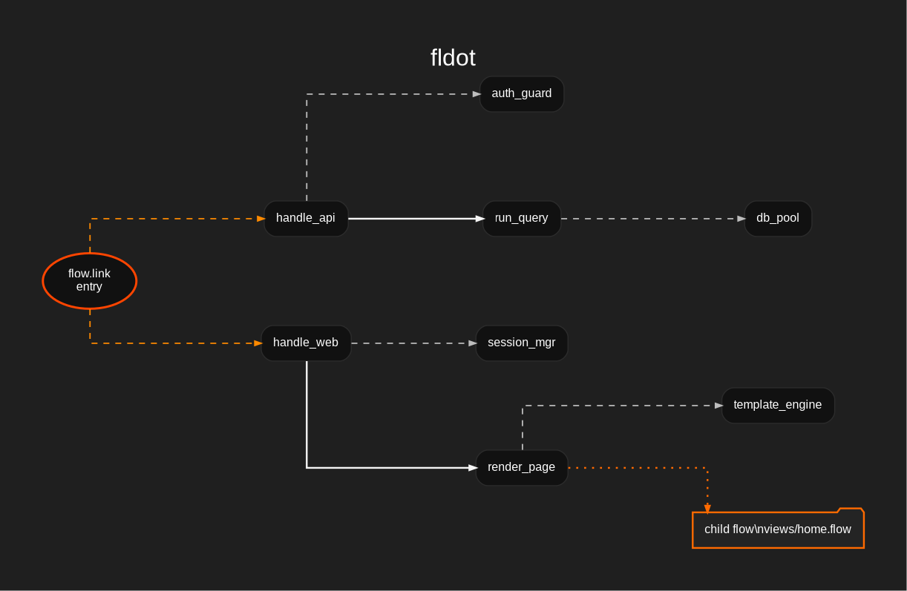

# fldot - Flow to DOT Converter

`fldot` is a command-line tool that converts `.flow` documents into DOT graph syntax. It parses node definitions, inheritance, and link structures to generate a visual representation of the execution flow that can be rendered using Graphviz or other DOT-compatible tools.



---

## CLI

### Examples

Generate DOT in the same directory (creates `example.dot`):

```bash
./bin/x86_64/linux/fldot -i example.flow
```

Generate DOT in a specific location:

```bash
./bin/x86_64/linux/fldot -i example.flow -o build/output.dot
```

Render the generated DOT file to PNG using Graphviz:

```bash
dot -Tpng example.dot -o example.png
```

---

### Parameters

| Command/Flag | Description |
| :--- | :--- |
| `-i`, `--input <file>` | Input `.flow` file (required) |
| `-o`, `--output <file>` | Output `.dot` file (optional, defaults to input path with `.dot` extension) |
| `-h`, `--help` | Show help and usage |
| `-v`, `--version` | Show version |

---

## Flow Metadata

Flow documents may attach display metadata under the `meta` namespace:

```flow
flow.meta.title=Website Runtime
flow.meta.summary=Registers the listener and dispatches parsed requests.

node.router.meta.title=Request Router
node.router.meta.summary=Extracts request.path from parsed HTTP fields.
```

`fldot` builds graph structure from execution fields such as `flow.link`,
`node.*.link`, `node.*.use`, and `node.*.file`. It uses `flow.meta.title` as
the visible graph label, and `node.*.meta.title` or `func.*.meta.title` as
visible element labels when present. Other metadata fields remain valid Flow
data and are safe to keep in input documents; `*.meta.summary` can later map to
DOT tooltip or graph-comment attributes.

---

## Theming

The visual appearance of the generated DOT graphs is fully customizable through the `src/theme.h` C header file. `fldot` is built with a sleek, dark KaisarCode product theme by default.

To change background colors, border colors, typography, node shapes, or edge styles, simply modify the macro definitions in `src/theme.h` and rebuild the project:

```c
#define KCV_BG                    "#1f1f1f"
#define KCV_NODE_FILL             "#111111"
#define KCV_NODE_SHAPE            "box"
#define KCV_ENTRY_EDGE_STYLE      "solid"
#define KCV_FILE_SHAPE            "folder"
```

---

## Build

Compiled artifacts are generated under `bin/{arch}/{platform}/` for the host architecture running the build.

```bash
make clean && make
```

### Tests

The portable test entry point is `make test`. Build project artifacts first, then run tests. Tests compile a test executable and run the built CLI through CTest.

```bash
make
make test
```

To run the common `test` target in Windows-through-Wine mode:

```bash
make x86_64/windows
make test wine
```

The portable C test source is `src/test.c`. Test binaries and runtime outputs are build artifacts and are not stored in the project tree.

Build targets such as `make x86_64/windows` compile project artifacts. Tests are run only through `make test` or `make test wine`.

### Multiarch Builds

The project is prepared to build artifacts for multiple architectures under `bin/{arch}/{platform}/`. A plain `make` builds only the current host architecture.

```bash
make all
make x86_64/linux
make x86_64/windows
make x86_64/macos
make x86_64/iossim
make i686/linux
make i686/windows
make aarch64/linux
make aarch64/android
make aarch64/macos
make aarch64/ios
make aarch64/iossim
make armv7/linux
make armv7/android
make armv7hf/linux
make riscv64/linux
make powerpc64le/linux
make mips/linux
make mipsel/linux
make mips64el/linux
make s390x/linux
make loongarch64/linux
```

---

## Development Requirements

### Build Tools

- `make` (GNU Make)
- `cmake` >= 3.14
- `ninja`
- `gcc` or `clang` (C11 compatible)

### System Libraries

Linux:
- `libpthread`
- `libm`

Windows (MSVC or MinGW):
- No additional system libraries required.

macOS / iOS:
- No additional system libraries required.

### Optional Cross-Compilation SDKs

Required only for multiarch builds:

- MinGW (`x86_64-w64-mingw32-gcc`) for Windows cross-compilation from Linux.
- `wine` for running Windows tests on Linux.
- `osxcross` with macOS and iOS SDKs for macOS and iOS targets.
- Android NDK (version 27.2.12479018) for Android targets.

### Test Dependencies

- `ctest` (included with cmake)

---

## Beta Notice

This is a beta project tested only on Debian x86_64. It was created out of a personal need for these tools, but no guarantees are provided regarding its stability or future support. You are free to test it, use it, and modify it as you please.

If you'd like to reach out, you can send an email to kaisar@kaisarcode.com. Please note that I do not accept pull requests; the goal is to avoid long-term dependency on platforms like GitHub, and I do not maintain fixed infrastructure to guarantee long-term stability for these projects.

---

## License

[](https://www.gnu.org/licenses/gpl-3.0.html)

This project is distributed under the **GNU General Public License version 3 (GPLv3)**.
